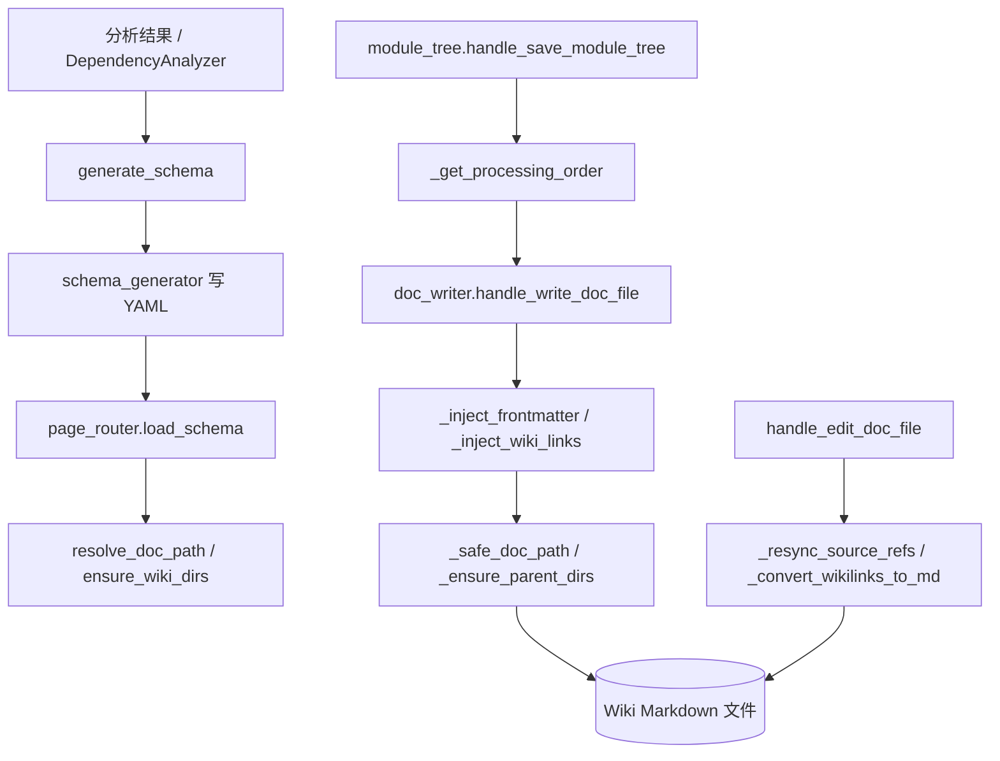

# MCP_Tools_DocWriter 模块文档

## 概述

`MCP_Tools_DocWriter` 是 CodeWiki 的文档写入与骨架生成层，负责把 [MCP_Tools_Analysis](MCP_Tools_Analysis.md) 与 [DependencyAnalyzer](DependencyAnalyzer.md) 产出的分析结果，转化为可落盘的 Wiki Markdown 文件。它包含四个子文件：`doc_writer.py`（文档写入核心）、`module_tree.py`（模块树与处理顺序）、`page_router.py`（Wiki 路径/目录路由）、`schema_generator.py`（Wiki 结构 schema 生成）。模块对外暴露 MCP 工具入口（`handle_write_doc_file`、`handle_edit_doc_file`、`handle_save_module_tree`、`handle_get_processing_order`、`generate_schema`），内部由大量私有辅助函数支撑路径安全、frontmatter 注入、wikilink 转换与历史留存。

## 组件清单

| 组件 | 类型 | 文件 | 职责 |
|------|------|------|------|
| handle_write_doc_file | 公开函数 | doc_writer.py | 写入新文档文件，注入 frontmatter 与 wikilink |
| handle_edit_doc_file | 公开函数 | doc_writer.py | 编辑已存在文档，重新同步引用与交叉链接 |
| _inject_frontmatter / _inject_lightweight_frontmatter / _build_okf_frontmatter | 私有函数 | doc_writer.py | 构造并注入 YAML frontmatter（含 OKF 兼容格式） |
| _inject_wiki_links / _inject_crosslinks / _convert_wikilinks_to_md / _replace_wikilink | 私有函数 | doc_writer.py | 注入/改写 wikilink 与跨链接，转换为标准 Markdown |
| _extract_source_refs / _resync_source_refs / _find_sources / _find_components | 私有函数 | doc_writer.py | 抽取与重同步源码引用、定位组件与来源 |
| _resolve_doc_path_safe / _safe_doc_path / _ensure_parent_dirs / _is_within | 私有函数 | doc_writer.py | 安全解析文档路径、创建父目录、越界校验 |
| _collect_wiki_terms / _comp_to_module / _save_history / _validate_mermaid | 私有函数 | doc_writer.py | 收集 wiki 术语、组件到模块映射、保存历史、校验 mermaid |
| handle_save_module_tree | 公开函数 | module_tree.py | 保存模块树并计算层级 |
| handle_get_processing_order | 公开函数 | module_tree.py | 返回模块处理顺序 |
| _collect / _count / _get_processing_order / _save_and_compute_order | 私有函数 | module_tree.py | 收集节点、计数、计算顺序、保存并算序 |
| generate_schema | 公开函数 | schema_generator.py | 生成 Wiki 目录结构 schema |
| _detect_naming_convention / _get_defaults / _load_existing_schema / _load_project_config / _merge_schemas / _write_yaml | 私有函数 | schema_generator.py | 探测命名约定、默认值、加载已有/项目配置、合并与写 YAML |
| resolve_doc_path / resolve_wiki_paths / compute_link_path / compute_depth | 公开函数 | page_router.py | 解析文档路径、Wiki 路径、计算链接相对路径与深度 |
| ensure_wiki_dirs / get_page_type_dir / is_wiki_system_file / load_schema / invalidate_schema_cache | 公开函数 | page_router.py | 确保目录存在、取页面类型目录、判断系统文件、加载/失效 schema 缓存 |

## 关键设计

- **路径安全优先**：所有文档写入均经 `_safe_doc_path` / `_resolve_doc_path_safe` / `_is_within` 校验，防止越出 Wiki 根目录。
- **Frontmatter 双模式**：支持完整 frontmatter 与轻量级（lightweight）模式，并兼容 OKF（Open Knowledge Format）格式。
- **Wikilink 双向转换**：写入时注入 `[[ModuleName]]` 式交叉链接，导出/编辑时 `_convert_wikilinks_to_md` 转标准 Markdown。
- **Schema 驱动路由**：`page_router.py` 依据 `load_schema` 的目录结构决定页面落盘位置与链接深度，缓存可经 `invalidate_schema_cache` 失效。
- **顺序化生成**：`module_tree.py` 通过依赖关系计算 `_get_processing_order`，保证底层模块先写。
- **可重入编辑**：`handle_edit_doc_file` 调用 `_resync_source_refs` 重同步源码引用，避免文档漂移。
- **配置模板单源**：`schema_generator._load_project_config` 只从包内 `codewiki/templates/schema.yaml`（`_CONFIG_PATH`）加载，已移除仓库根同名文件的回退分支；`_get_defaults` 用其覆盖硬编码默认值，因此新增/调整全局配置（如 `conventions`）只需改包内模板一份，源码树与 wheel 分发走同一路径。
- **配置模板单源**：`schema_generator._load_project_config` 只从包内 `codewiki/templates/schema.yaml`（`_CONFIG_PATH`）加载，已移除仓库根同名文件的回退分支；`_get_defaults` 用其覆盖硬编码默认值，因此新增/调整全局配置（如 `conventions`）只需改包内模板一份，源码树与 wheel 分发走同一路径。

## 数据流（mermaid）



## 依赖关系

- [MCP_Server](MCP_Server.md)：注册并调度本模块暴露的 MCP 工具入口。
- [MCP_Core](MCP_Core.md)：提供工具基础框架与上下文。
- [MCP_Cache](MCP_Cache.md)：与 `page_router` 的 schema 缓存协同失效。
- [MCP_Tools_Analysis](MCP_Tools_Analysis.md) / [DependencyAnalyzer](DependencyAnalyzer.md)：提供组件与依赖数据。
- [SharedConfig](SharedConfig.md)：项目配置与命名约定来源，被 `schema_generator._load_project_config` 使用。
- [LLM_Backend](LLM_Backend.md)：文档内容生成的后端支撑。

## 使用示例

```python
# 写入一份模块文档（由 MCP 工具调用）
result = handle_write_doc_file(
    module="MCP_Tools_DocWriter",
    content="# 概述\n...",
    wiki_root="/repo/wiki",
)
# 编辑并重新同步源码引用
handle_edit_doc_file(path="wiki/MCP_Tools_DocWriter.md", content=new_md)
# 生成并保存模块树顺序
handle_save_module_tree(tree=module_tree, wiki_root="/repo/wiki")
order = handle_get_processing_order(wiki_root="/repo/wiki")
# 生成 wiki schema
generate_schema(project_root="/repo", wiki_root="/repo/wiki")
```

## 扩展点（新增文档写入工具）

1. 在 `doc_writer.py` 中新增 `handle_xxx_doc_file`，复用 `_safe_doc_path` / `_inject_frontmatter` 等私有辅助。
2. 若涉及新页面类型，扩展 `page_router.get_page_type_dir` 并在 `schema_generator._get_defaults` 加入默认目录。
3. 新增跨链接策略时，扩展 `_inject_crosslinks` / `_replace_wikilink` 并同步 `_convert_wikilinks_to_md`。
4. 新全局配置项经 `schema_generator._load_project_config` 读取，并在 `_merge_schemas` 中合并。

## 相关模块

- [MCP_Server](MCP_Server.md)：工具注册与调度。
- [MCP_Core](MCP_Core.md)：核心框架。
- [MCP_Cache](MCP_Cache.md)：schema 缓存协同。
- [MCP_Tools_Analysis](MCP_Tools_Analysis.md)：分析数据来源。
- [MCP_Tools_Dependency](MCP_Tools_Dependency.md) / [DependencyAnalyzer](DependencyAnalyzer.md)：依赖与处理顺序。
- [MCP_Tools_Knowledge](MCP_Tools_Knowledge.md) / [MCP_Tools_Quality](MCP_Tools_Quality.md)：知识库与质量校验。
- [MCP_Prompts](MCP_Prompts.md)：提示词模板。
- [SharedConfig](SharedConfig.md)：配置中心。
- [LLM_Backend](LLM_Backend.md)：内容生成后端。
