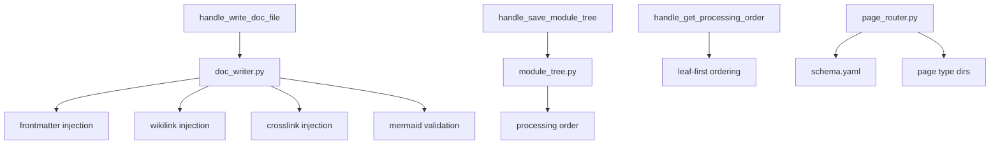

# MCP Document Writer Tools

## Overview

MCP tool handlers for creating and editing wiki documentation, managing the module tree, resolving page routes, and generating the schema.yaml convention file.

## Architecture

## Components

### write_doc_file / edit_doc_file (doc_writer.py)
- Injects YAML frontmatter with OKF compliance
- Auto-generates crosslinks (depends_on/depended_by) from dependency graph
- Injects wikilinks [[PageName]] for referenced modules
- Validates Mermaid diagram syntax
- Routes files to page_type subdirectories (modules/, entities/, concepts/)
- Saves edit history for audit trail

### save_module_tree / get_processing_order (module_tree.py)
- Persists module tree JSON to `.meta/module_tree.json`
- Computes leaf-first processing order via topological sort
- Writes processing order to workspace file

### Page Router (page_router.py)
- **resolve_doc_path**: Maps page type + filename to output path
- **load_schema**: Loads schema.yaml for documentation conventions
- **compute_depth**: Calculates module nesting depth for link paths
- Supports wiki page types: module, entity, concept, source, comparison, query

### Schema Generator (schema_generator.py)
- **generate_schema**: Creates schema.yaml from project conventions
- Detects naming conventions, section requirements, documentation dimensions
- Merges with existing schema for incremental updates

## Cross References

- [MCP_Core](MCP_Core.md): Session provides output_dir and workspace
- [MCP_Tools_Analysis](MCP_Tools_Analysis.md): Analysis data for crosslink injection
- [[MCP_Tools_Knowledge]]: Wiki search index uses written files
- [LLM_Backend](LLM_Backend.md): [DocumentationGenerator](../../../codewiki/src/be/documentation_generator.py)'s agent calls write_doc_file

<!-- crosslinks (auto-generated) -->
## Related Modules
- Depends on: [CLI_Utils](cli_utils.md), [LLM_Backend](llm_backend.md), [MCP_Tools_Analysis](mcp_tools_analysis.md), [MCP_Tools_Knowledge](mcp_tools_knowledge.md), [MCP_Tools_Quality](mcp_tools_quality.md), [SharedConfig](sharedconfig.md)
- Used by: [MCP_Core](mcp_core.md), [MCP_Tools_Analysis](mcp_tools_analysis.md), [MCP_Tools_Knowledge](mcp_tools_knowledge.md)
