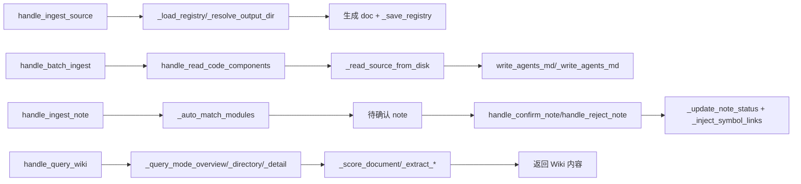

# MCP_Tools_Knowledge 模块文档

## 概述

`MCP_Tools_Knowledge` 是 CodeWiki MCP 服务的知识库工具集（leaf 模块），聚焦于**离线知识沉淀与检索闭环**：从源码/AGENTS.md 生成结构化文档，录入笔记要点，并提供多模式的 Wiki 查询能力。包含 6 个源文件、44 个组件，对外暴露 10 个 `handle_*` 工具入口，内部由大量 `_` 私有辅助函数支撑解析、匹配、打分与符号链接注入。

## 组件清单

| 组件 | 类型 | 文件 | 职责 |
|------|------|------|------|
| `handle_query_wiki` | 公开 | knowledge_loop.py | Wiki 多模式查询总入口（overview/directory/detail） |
| `handle_ingest_note` | 公开 | knowledge_loop.py | 接收用户笔记要点并暂存为待确认 note |
| `handle_confirm_note` | 公开 | knowledge_loop.py | 确认 note，注入到对应模块文档 |
| `handle_reject_note` | 公开 | knowledge_loop.py | 拒绝 note，标记状态 |
| `handle_batch_ingest` | 公开 | batch_ingest.py | 批量摄入多个源码路径生成文档 |
| `handle_read_code_components` | 公开 | code_reader.py | 读取代码组件（类/函数）用于文档生成 |
| `handle_view_repo_file` | 公开 | file_viewer.py | 查看仓库内文件内容 |
| `handle_ingest_source` | 公开 | source_ingest.py | 摄入源文件并建立 source→doc 注册表 |
| `handle_retract_source` | 公开 | source_ingest.py | 撤回已摄入的源文件 |
| `write_agents_md` | 公开 | agents_md.py | 生成 AGENTS.md 入口文档 |
| `_extract_*` (`_extract_frontmatter`,`_extract_frontmatter_block`,`_extract_keywords`,`_extract_section`,`_extract_tags`,`_get_module_components`,`_get_module_doc_name`) | 私有 | knowledge_loop.py | 从文档抽取 frontmatter/关键词/段落/标签与模块组件映射 |
| `_query_mode_*` (`_query_mode_overview`,`_query_mode_directory`,`_query_mode_detail`) | 私有 | knowledge_loop.py | 三种查询模式的内部实现 |
| `_` 其他辅助 (`_auto_match_modules`,`_collect`,`_walk`,`_load_symbol_map`,`_inject_symbol_links`,`_replace_symbol`,`_protect`,`_resolve_within`,`_score_document`,`_slugify`,`_legacy_keyword_search`,`_update_note_status`) | 私有 | knowledge_loop.py | 模块自动匹配、目录遍历、符号映射/链接注入、文档打分、slug 化与状态更新 |
| `_build_section` / `_extract_modules` / `_write_agents_md` | 私有 | agents_md.py | 构建 AGENTS.md 章节、解析模块列表、落盘写入 |
| `_read_source_from_disk` | 私有 | code_reader.py | 从磁盘读取源文件内容 |
| `_clean_source_refs` / `_count_source_refs` / `_load_registry` / `_resolve_output_dir` / `_save_registry` | 私有 | source_ingest.py | 源引用清理/计数、注册表加载/保存、输出目录解析 |

## 关键设计

1. **查询三模式**：`overview` 给目录鸟瞰，`directory` 列模块与组件，`detail` 深入单模块文档并注入符号链接。
2. **符号链接注入**：`_load_symbol_map` + `_inject_symbol_links` + `_replace_symbol` 将文档中的 `[[Symbol]]` 跨文档互链，提升可导航性。
3. **笔记闭环**：`ingest→confirm/reject` 状态机（`_update_note_status`）保证用户知识可控沉淀。
4. **源注册表**：source_ingest 维护 registry 记录 source 与生成 doc 的映射，支持 retract 回滚。
5. **AGENTS.md 自动生成**：从各模块 frontmatter 抽取组件，聚合为仓库入口文档。

## 数据流（mermaid）



## 依赖关系

- [[MCP_Server]]：注册并调度上述 `handle_*` 工具。
- [[MCP_Core]]：复用知识库读写与文档模型。
- [[MCP_Cache]]：缓存 symbol map 与查询结果。
- [[MCP_Tools_Quality]]：文档质量校验（注入前）。
- [[SharedConfig]]：仓库路径、输出目录等配置。

## 使用示例

```python
# 摄入源码并生成文档
await handle_ingest_source(repo="myrepo", paths=["src/foo.py"])
await handle_batch_ingest(repo="myrepo", roots=["src/"])

# 用户补充知识
await handle_ingest_note(repo="myrepo", text="Foo 负责鉴权", module="Foo")
await handle_confirm_note(repo="myrepo", note_id="n1")

# 查询 Wiki
result = await handle_query_wiki(repo="myrepo", mode="detail", module="Foo")
```

## 扩展点（新增知识库工具）

1. 在 `knowledge_loop.py` 新增 `handle_*` 并复用 `_extract_*`/`_score_document` 辅助。
2. 新增查询模式：扩展 `_query_mode_*` 并在 `handle_query_wiki` 分发。
3. 新的摄入源类型：仿 `source_ingest.py` 增加 registry 维护函数。
4. AGENTS.md 模板扩展：`_build_section` 支持新 frontmatter 字段。

## 相关模块

[[MCP_Server]] [[MCP_Core]] [[MCP_Cache]] [[MCP_Tools_Quality]] [[MCP_Tools_DocWriter]] [[MCP_Tools_Analysis]] [[SharedConfig]] [[LLM_Backend]]
