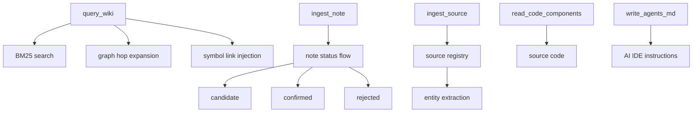

# MCP Knowledge Management Tools

## Overview

MCP tool handlers for the knowledge management flywheel: querying wiki content, ingesting development notes, importing external sources, reading code components, and generating AGENTS.md for AI IDE integration.

## Architecture

## Components

### query_wiki (knowledge_loop.py)
Three-layer search strategy:
1. **Overview mode**: BM25 full-text search across wiki docs
2. **Directory mode**: Filter by module/page type
3. **Detail mode**: Deep read with symbol link injection and keyword scoring

Note lifecycle: ingest_note → candidate → confirm_note/reject_note

### ingest_note / confirm_note / reject_note
- **ingest_note**: Creates note candidates with extracted keywords and tags
- **confirm_note**: Promotes candidate to confirmed wiki page
- **reject_note**: Marks note as rejected with reason

### ingest_source / retract_source (source_ingest.py)
- **ingest_source**: Imports external documents, extracts entities/concepts
- **retract_source**: Removes imported source and derived pages
- Maintains source_registry.json for tracking

### read_code_components (code_reader.py)
- Reads source code for specified component IDs from disk
- Returns file content with line ranges

### view_repo_file (file_viewer.py)
- Reads arbitrary files from the analyzed repository

### batch_ingest (batch_ingest.py)
- Bulk import of multiple source documents

### write_agents_md (agents_md.py)
- Generates AGENTS.md with wiki usage instructions for AI IDEs
- Extracts module names and builds section references

## Cross References

- [MCP_Cache](MCP_Cache.md): BM25 search index
- [MCP_Tools_DocWriter](MCP_Tools_DocWriter.md): write_doc_file for confirmed notes
- [[MCP_Tools_Quality]]: wiki_search.py provides search engine
- [DocVisualizer](DocVisualizer.md): Wiki content consumed by visualizer

<!-- crosslinks (auto-generated) -->
## Related Modules
- Depends on: [CLI_Utils](cli_utils.md), [DocVisualizer](docvisualizer.md), [MCP_Cache](mcp_cache.md), [MCP_Tools_Analysis](mcp_tools_analysis.md), [MCP_Tools_DocWriter](mcp_tools_docwriter.md), [MCP_Tools_Quality](mcp_tools_quality.md), [SharedConfig](sharedconfig.md)
- Used by: [MCP_Core](mcp_core.md), [MCP_Tools_DocWriter](mcp_tools_docwriter.md)
