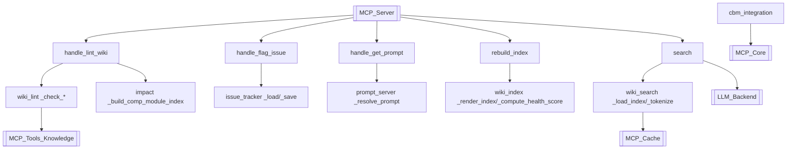

# MCP_Tools_Quality 模块文档
## 概述
`MCP_Tools_Quality` 是 CodeWiki MCP 工具层中的质量与索引子模块，负责对生成的 Wiki 文档进行健康检查（lint）、全文检索（search）、索引重建（index）、问题标记（issue）、跨服务架构追踪（cbm）以及 prompt 解析（prompt_server）。它保障了 Wiki 内容的一致性、可追溯性与可检索性，是 [[MCP_Server]] 对外暴露质量类工具的核心实现。

## 组件清单
| 组件 | 类型 | 文件 | 职责 |
| --- | --- | --- | --- |
| cbm_get_architecture / cbm_trace_cross_service / is_cbm_available / merge_cbm_and_local_results | 函数 | cbm_integration.py | 与架构知识库（CBM）集成，查询架构图、追踪跨服务调用、判断可用性并合并本地与 CBM 结果 |
| read_param / read_json_param | 函数 | file_param.py | 从文件读取普通参数或 JSON 参数，供工具调用解析入参 |
| _fnv1a_32 / _generate_issue_id / _load_issues / _save_issues | 私有函数 | issue_tracker.py | 用 FNV-1a 哈希生成 issue id，加载/保存问题清单 |
| handle_flag_issue | 函数 | issue_tracker.py | MCP 入口：标记 Wiki 中的质量问题为 issue 并落盘 |
| _build_schema_constraints / _resolve_prompt | 私有函数 | prompt_server.py | 构造 prompt 的 schema 约束并解析 prompt 模板 |
| handle_get_prompt | 函数 | prompt_server.py | MCP 入口：按名称返回带 schema 约束的 prompt |
| _append_with_lock / _atomic_write / _parse_note_frontmatter / _extract_doc_title_and_summary / _render_index | 私有函数 | wiki_index.py | 加锁追加、原子写、解析笔记 frontmatter、抽取标题摘要、渲染索引页 |
| _compute_health_score | 私有函数 | wiki_index.py | 计算 Wiki 健康度评分 |
| append_log / rebuild_index | 函数 | wiki_index.py | 记录操作日志、重建整体 Wiki 索引与健康度 |
| _check_broken_links / _check_coverage / _check_cycles / _check_missing_aliases / _check_no_outlinks / _check_orphan_pages / _check_overview_stale_lint / _check_stale_refs / _check_stale_sources / _check_superseded_pages / _check_undocumented / _check_unsupported_claims | 私有函数 | wiki_lint.py | 12 项质量检查：死链、覆盖率、环路、缺别名、无外链、孤儿页、概览过期、陈旧引用、陈旧源、被取代页、未文档化组件、无支撑声明 |
| _get_all_module_names / _get_documented_components / _get_output_dir / _load_module_tree / _walk | 私有函数 | wiki_lint.py | 收集模块名、已文档组件、输出目录、加载模块树并遍历 |
| handle_lint_wiki | 函数 | wiki_lint.py | MCP 入口：执行全部 lint 检查并返回报告 |
| _IndexData / _check_jieba / _extract_fm / _extract_snippet / _extract_title / _index_path / _load_index / _open_standalone_cache / _read_doc / _read_note / _resolve_db_path / _save_index / _tokenize | 私有函数 | wiki_search.py | 索引数据结构、jieba 检测、frontmatter/摘要/标题抽取、路径与 DB 解析、读写缓存与索引、文档/笔记读取、分词 |
| build_full_index / update_file / remove_file / search | 函数 | wiki_search.py | 全量建索引、增量更新/删除、检索查询 |
| _build_comp_module_index | 函数 | impact.py | 构建组件到模块的索引，支撑影响分析 |

## 关键设计
- **分层私有辅助**：大量 `_` 前缀私有函数封装细节，公开 `handle_*` / `build_*` / `search` 等作为 MCP 工具边界。
- **原子与并发安全**：`wiki_index` 用 `_atomic_write` + `_append_with_lock` 保证多进程写入安全。
- **可插拔分词**：`_check_jieba` 自动检测 jieba，降级为正则分词，兼容无依赖环境。
- **质量门禁**：`wiki_lint` 的 12 项检查覆盖链接、覆盖、时效、一致性，输出结构化报告。
- **CBM 融合**：`cbm_integration` 在本地分析外引入架构知识库，合并视图提升准确性。

## 数据流（mermaid）


## 依赖关系
- [[MCP_Server]]：工具注册与调用入口
- [[MCP_Core]]：CBM/基础能力
- [[MCP_Cache]]：搜索索引缓存
- [[MCP_Tools_Knowledge]]：模块树与文档元数据
- [[LLM_Backend]]：声明校验与语义
- [[SharedConfig]]：输出目录与配置

## 使用示例
```python
# 执行 Wiki 质量检查
result = handle_lint_wiki(output_dir="./wiki")
# 全文检索
hits = search(query="认证流程", db_path="./wiki/search.db")
# 重建索引
rebuild_index(output_dir="./wiki")
# 标记问题
handle_flag_issue(path="auth.md", reason="死链")
```

## 扩展点（新增质量工具）
1. 在 `wiki_lint.py` 增加 `_check_xxx` 并在 `handle_lint_wiki` 注册。
2. 在 `wiki_search.py` 扩展 `_tokenize` 支持新语言或向量检索。
3. 在 `cbm_integration.py` 接入新的外部知识源并合并。
4. 复用 `file_param.py` 的 `read_param` 解析新工具入参。

## 相关模块
- [[MCP_Server]] 工具路由
- [[MCP_Tools_Knowledge]] 知识抽取
- [[MCP_Tools_DocWriter]] 文档生成
- [[MCP_Tools_Analysis]] 代码分析
- [[MCP_Cache]] 索引缓存
- [[SharedConfig]] 配置中心
