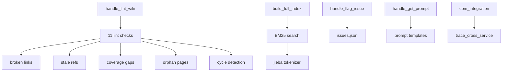

# MCP Quality & Infrastructure Tools

## Overview

MCP tools for wiki quality assurance (11 lint checks), BM25 search indexing, issue tracking, prompt template serving, CBM (Codebase Memory) integration, and file-based parameter handling.

## Architecture

## Components

### Wiki Lint (wiki_lint.py) - 11 Checks
1. **Broken links**: Wikilink references to non-existent pages
2. **Stale refs**: References to deleted source files
3. **Coverage gaps**: Undocumented components
4. **Orphan pages**: Pages with no inbound links
5. **No-outlink pages**: Pages with no outbound references
6. **Missing aliases**: Pages without alias frontmatter
7. **Cycle detection**: Circular dependencies between modules
8. **Superseded pages**: Pages marked as superseded
9. **Stale sources**: Source refs pointing to changed files
10. **Unsupported claims**: Assertions without code evidence
11. **Overview staleness**: Overview referencing stale module data

### Wiki Search (wiki_search.py)
- **build_full_index**: Constructs BM25 search index from all wiki docs
- **search**: Full-text search with BM25 ranking
- **update_file / remove_file**: Incremental index updates
- Optional jieba Chinese tokenization support

### Wiki Index (wiki_index.py)
- **rebuild_index**: Generates index.md with health score
- **append_log**: Appends generation events to log.md
- Health score computed from lint results

### Issue Tracker (issue_tracker.py)
- **handle_flag_issue**: Creates/manages issues in issues.json
- FNV1a-32 hash for deterministic issue IDs

### Prompt Server (prompt_server.py)
- **handle_get_prompt**: Resolves and returns prompt templates
- Builds schema constraints from schema.yaml

### CBM Integration (cbm_integration.py)
- Integrates with Codebase Memory for cross-service tracing
- Merges CBM and local analysis results

### File Parameter (file_param.py)
- Reads large JSON parameters from workspace files

## Cross References

- [MCP_Tools_DocWriter](MCP_Tools_DocWriter.md): Lint checks written docs
- [MCP_Cache](MCP_Cache.md): Search index built from cached wiki content
- [MCP_Core](MCP_Core.md): close_session triggers index rebuild
- [DocVisualizer](DocVisualizer.md): Lint report consumed by visualizer

<!-- crosslinks (auto-generated) -->
## Related Modules
- Depends on: [CLI_Utils](cli_utils.md), [DocVisualizer](docvisualizer.md), [GraphAndSort](graphandsort.md), [LLM_Backend](llm_backend.md), [MCP_Cache](mcp_cache.md), [MCP_Tools_Analysis](mcp_tools_analysis.md), [SharedConfig](sharedconfig.md)
- Used by: [AnalysisPipeline](analysispipeline.md), [LLM_Backend](llm_backend.md), [LanguageAnalyzers](languageanalyzers.md), [MCP_Core](mcp_core.md), [MCP_Tools_Analysis](mcp_tools_analysis.md), [MCP_Tools_DocWriter](mcp_tools_docwriter.md), [MCP_Tools_Knowledge](mcp_tools_knowledge.md), [RouteExtractors](routeextractors.md)
