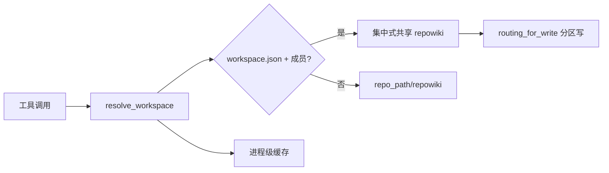

# MCP_Tools_Workspace 模块文档

## 概述
`MCP_Tools_Workspace` 是 CodeWiki 的工作区布局路由与多仓引导工具（`workspace_layout.py` + `workspace_bootstrap.py`）：前者回答「任意 repo_path/output_dir 应该落到哪个知识库根」，是集中式（centralized）与就地（colocated）知识库布局的唯一路由接缝——每个按 `output_dir` 路由知识的工具都经 `resolve_workspace` 而非自行遍历目录；后者是 `init_workspace` 的实现，生成/更新各成员仓的 `bootstrap.ps1`/`bootstrap.sh`（含 repos 注册表与共享补丁），并用与模板共享的骨架行锚点把注册表解析回仓库清单。

## 组件清单

| 组件 | 类型 | 文件 | 职责 |
|------|------|------|------|
| `find_workspace_root` / `read_layout_value` / `read_layout` | 函数 | workspace_layout.py | 自起点向上查找 workspace 配置（仅 `repowiki/.meta/workspace.json` 是发现信号）；宽容读取/解析 `wiki_layout` 值（缺失/损坏/非法一律宽松回退） |
| `WorkspaceResolution` | 类 | workspace_layout.py | 解析结果（root/layout/member）；`centralized` 属性即集中式路由决策点 |
| `resolve_workspace` | 函数 | workspace_layout.py | 按四条护栏解析 repo_path：仅 workspace.json 为发现信号 / 命中仍需注册表成员资格 / 三态回退到 colocated / 进程级结果缓存（`clear_cache` 供测试） |
| `default_output_dir` | 函数 | workspace_layout.py | 集中式成员 → 工作区共享 `repowiki`；其余 → 状态维持 `repo_path/repowiki` |
| `is_centralized_corpus` | 函数 | workspace_layout.py | 判断 output_dir 是否落在集中式 corpus（用于门控 `repo=` 查询过滤等布局专属语义） |
| `routing_for_write` | 函数 | workspace_layout.py | 判定写入是否需要分区：仅当 repo 是集中式成员且 output_dir 恰为该工作区 repowiki 时返回注册目录名（module 页路由到共享池的依据） |
| `read_provenance` / `parse_scope_arg` / `merge_provenance` | 函数 | workspace_layout.py | 读取/规范化 `repo:`/`repos:` provenance；合并时写入 frontmatter `metadata:` 节点之下（避免 OKF lint 顶层键告警），global 清空 provenance |
| `_read_text` | 私有函数 | workspace_bootstrap.py | utf-8-sig 读取（去 BOM）+ CRLF 归一（表正则锚定 `\n` 依赖此约定） |
| `_write_text` | 私有函数 | workspace_bootstrap.py | 写脚本：`.ps1` 强制 utf-8-sig（Windows PowerShell 5.1 会把无 BOM 脚本按 ANSI/GBK 解码导致中文乱码），`.sh` 保持无 BOM（BOM 会破坏 shebang） |
| `_ensure_ps1_bom` | 私有函数 | workspace_bootstrap.py | 对 BOM 修复前生成的 bootstrap.ps1 做字节级补 BOM（内容与行尾保持逐字节不变） |
| `_load_tables` | 私有函数 | workspace_bootstrap.py | 从 bootstrap 脚本内的 repos 注册表（shell `declare -A` / PowerShell `[ordered]@{}`）按骨架行锚点解析回仓库清单 |

## 关键设计

- **单一路由接缝**：所有按 `output_dir` 路由知识的工具必须经 `resolve_workspace`，禁止自行遍历目录猜测；bootstrap 注册表本身**不是**发现信号——无 `workspace.json` 的目录一律按 v5.5.0 状态维持处理。
- **成员制**：workspace 根下的目录名必须出现在注册表才路由集中式，游离 clone（如意外落在工作区树内的第三方仓库）不会被误纳入共享知识库。
- **字节级 BOM 纪律**：`.ps1` 必须有 BOM（否则 Windows PowerShell 5.1 按 ANSI 解码把中文变乱码直到脚本无法解析）；`.sh` 绝不能有 BOM（破坏 `#!/` shebang）。`_ensure_ps1_bom` 对历史文件做字节级修复。
- **骨架行共享**：模板与手建工作区共用同一批注册表骨架行（`_SH_TABLE_RE`/`_PS_TABLE_RE`），任何改动必须同步模板与正则，保证注册表可被可靠回读；目录名受 `_NAME_RE` 约束（同时作 shell 键与 gitignore 模式，免引号）。
- **三态回退**：找不到 workspace / 非成员 / colocated 都回到 `repo_path/repowiki`，保证集中式功能对存量单仓完全惰性。

## 数据流（mermaid）



## 依赖关系

- 被各 MCP 工具经 [KnowledgeStore](KnowledgeStore.md) 的 bridge（`resolve_output_dir`）消费。
- `workspace_bootstrap` 被 layout 模块惰性 import（避免加载期循环依赖）。
- 对应集中式布局 spec：`.scratch/centralized-wiki-layout/spec.md`。

## 使用示例

```python
from codewiki.mcp.tools.workspace_layout import resolve_workspace, routing_for_write
res = resolve_workspace(repo_path)
if res.centralized:
    out = res.root / "repowiki"        # 共享知识库
    name = routing_for_write(out, repo_path)  # 分区名 / None
```
