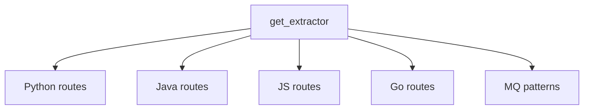

# Route Extractors

## Overview

Language-specific route extractors that parse HTTP API endpoints and MQ (message queue) patterns from source code for cross-service dependency analysis.

## Architecture

## Components

### HTTP Route Extractors
- **python_routes.py**: Extracts FastAPI/Flask/Django routes via AST visitor pattern. Handles @app.route, @router.get/post decorators
- **java_routes.py**: Parses Spring Boot @RequestMapping, @GetMapping, etc. annotations
- **js_routes.py**: Express/Koa/Next.js route patterns from JS/TS files
- **go_routes.py**: Go HTTP handler registration (http.HandleFunc, gin, echo)

### MQ Pattern Extractor (mq_patterns.py)
- Extracts message queue producers/consumers from annotated classes
- Detects @RabbitListener, @KafkaListener, @SqsListener patterns
- Identifies enclosed class and function context for each MQ endpoint

### Registry (__init__.py)
- **get_extractor**: Factory function returning the appropriate extractor for a given language
- Lazy registration pattern for efficient loading

## Cross References

- [LanguageAnalyzers](LanguageAnalyzers.md): Provides AST data for route extraction
- [AnalysisPipeline](AnalysisPipeline.md): [CrossServiceMatcher](../../../codewiki/src/be/dependency_analyzer/analysis/cross_service_matcher.py) uses extracted routes for dependency matching
- [AnalyzerUtils](AnalyzerUtils.md): Path canonicalizer for route normalization

<!-- crosslinks (auto-generated) -->
## Related Modules
- Depends on: [AnalyzerModels](analyzermodels.md), [AnalyzerUtils](analyzerutils.md), [MCP_Tools_Quality](mcp_tools_quality.md)
- Used by: [AnalysisPipeline](analysispipeline.md)
