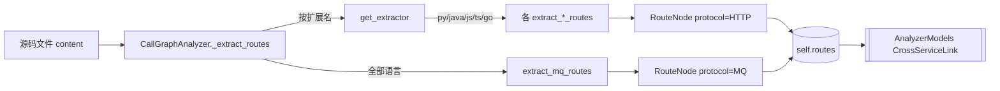

# RouteExtractors 模块文档

## 概述
RouteExtractors 是 `DependencyAnalyzer` 的叶子模块，负责从各语言源文件中**提取路由节点（`RouteNode`）**，供跨服务（cross-service）调用分析使用。它位于 AST/调用图分析之后的一次轻量级「后处理」（post-pass）。每个提取器签名统一为 `(file_path, content, repo_name) -> List[RouteNode]`，输出协议无关的会合点（rendezvous point），便于不同仓库间的服务端/客户端路由两两匹配。

模块覆盖三类协议提取：HTTP（按语言分 Go/Java/JS/TS/Python）、MQ（语言无关的消息队列模式，跨 Kafka/RabbitMQ/RocketMQ/Celery）、以及 Python 的 AST 驱动提取。所有提取器产出统一的 `RouteNode`，由 [[AnalyzerModels]] 中的 `cross_service` 模型定义。

## 组件清单
| 组件 | 类型 | 文件 | 职责 |
|------|------|------|------|
| `_lazy_register` | 函数 | `__init__.py` | 惰性导入并注册各语言提取器到 `EXTRACTORS` 字典（按扩展名映射） |
| `get_extractor` | 函数 | `__init__.py` | 按文件扩展名返回对应 HTTP 提取器，未知扩展名返回 `None` |
| `_GoRouteParser` | 类 | `go_routes.py` | Go 路由解析器，识别 Gin/Chi/mux/net/http 服务端及客户端调用 |
| `_get_relative_path` | 函数 | `go_routes.py` | 计算文件相对路径，异常时回退为原路径 |
| `_strip_url_to_path` | 函数 | `go_routes.py` | 去掉 scheme+host，仅保留路径，相对 URL 补前导 `/` |
| `extract_go_routes` | 函数 | `go_routes.py` | Go 文件入口，构造解析器并执行 `parse()` |
| `_JavaRouteParser` | 类 | `java_routes.py` | Java 路由解析器，基于正则（避免引入 tree-sitter） |
| `_extract_string_literal` | 函数 | `java_routes.py` | 从 Java 引号字符串中提取值 |
| `_get_relative_path` | 函数 | `java_routes.py` | 同上（Java 版） |
| `_strip_url_to_path` | 函数 | `java_routes.py` | 同上（Java 版） |
| `extract_java_routes` | 函数 | `java_routes.py` | Java 文件入口 |
| `_JsRouteParser` | 类 | `js_routes.py` | JS/TS 路由解析器，支持 Express/NestJS/axios/fetch |
| `_get_relative_path` | 函数 | `js_routes.py` | 同上（JS 版） |
| `_strip_url_to_path` | 函数 | `js_routes.py` | 同上（JS 版） |
| `extract_js_routes` | 函数 | `js_routes.py` | JS 文件入口（language=javascript） |
| `extract_ts_routes` | 函数 | `js_routes.py` | TS 文件入口（language=typescript），复用 `_JsRouteParser` |
| `_Pattern` | 类 | `mq_patterns.py` | 封装一条 MQ 正则模式（pattern/broker/role/topic_group） |
| `_component_id` | 函数 | `mq_patterns.py` | 生成 `rel::Class.method` 形式的组件 ID |
| `_find_enclosing_class` | 函数 | `mq_patterns.py` | 跨语言查找包围类/接口名 |
| `_find_enclosing_function` | 函数 | `mq_patterns.py` | 跨语言查找包围函数名（Java/Kotlin/Python/Go/JS） |
| `extract_mq_routes` | 函数 | `mq_patterns.py` | 语言无关 MQ 生产者/消费者提取 |
| `_RouteVisitor` | 类 | `python_routes.py` | `ast.NodeVisitor` 子类，遍历 Python AST 收集路由 |
| `_component_id_from_context` | 函数 | `python_routes.py` | 从文件/函数/类上下文生成组件 ID |
| `_get_relative_path` | 函数 | `python_routes.py` | 同上（Python 版） |
| `_strip_url_to_path` | 函数 | `python_routes.py` | 同上（Python 版） |
| `extract_python_routes` | 函数 | `python_routes.py` | Python 文件入口，`ast.parse` 后驱动 Visitor |

## 关键设计
### HTTP 路由提取（Go）
`_GoRouteParser.parse()` 依次执行四个子步骤：`_extract_gin_routes`（正则 `obj.METHOD("/path")` 匹配 Gin，`ANY` 归并为 `GET`）、`_extract_mux_routes`（Chi/Echo/mux，`HandleFunc/Handle` 默认 `GET`，并跳过 `http`/`client` 等客户端对象）、`_extract_http_server_routes`（`http.HandleFunc/Handle` 服务端）、`_extract_client_calls`（`http.Get/Post/NewRequest` 客户端调用）。`_find_enclosing_function` 用 `func ...(` 回溯定位所属函数以构造 `component_id`。

### HTTP 路由提取（Java）
`_JavaRouteParser` 刻意**不使用 tree-sitter**，仅用正则，避免与 [[LanguageAnalyzers]] 的主解析器耦合。`parse()` 覆盖：Spring 的 `@GetMapping` 等组合注解与 `@RequestMapping`（含 `method=RequestMethod.GET` 解析）、JAX-RS 的 `@GET`+`@Path`（拼接类级 `@Path` 前缀）、Feign（复用 Spring 注解）、客户端 `RestTemplate`/`WebClient` 调用。辅助函数 `_find_next_method_name`/`_find_enclosing_class`/`_find_enclosing_method`/`_find_class_path` 负责从原始文本反推方法/类上下文。

### HTTP 路由提取（JS/TS）
`_JsRouteParser` 支持 Express/Koa（`app.get("/path")`）、NestJS（`@Get("/path")` + 拼接 `@Controller` 前缀）、客户端 `axios`/`fetch`/`got`/`ky`。`extract_js_routes` 与 `extract_ts_routes` 共用同一解析器，仅 `language` 参数不同。`_extract_client_calls` 对 `fetch` 会额外扫描附近 options 中的 `method` 字段推断 HTTP 方法。

### Python 路由提取（AST 驱动）
与上面语言不同，Python 用标准库 `ast` 而非正则：`extract_python_routes` 先 `ast.parse`（`SyntaxError` 时返回空），`_RouteVisitor` 通过 `visit_FunctionDef`/`visit_AsyncFunctionDef` 在装饰器上识别 FastAPI/Flask 服务端路由，通过 `visit_Call` 识别 `requests`/`httpx`/`aiohttp` 客户端调用。`_extract_string_arg` 支持普通字符串与 f-string（表达式替换为 `{}`）。Django 的 `path()`/`url()` 在 `visit_Call` 路径预留处理。

### MQ 消息路由提取（语言无关）
`extract_mq_routes` 遍历 `ALL_PATTERNS`（由 `_Pattern` 描述），覆盖 Kafka（`@KafkaListener`/kafkaTemplate）、RabbitMQ（`@RabbitListener`/rabbitTemplate）、RocketMQ（`@RocketMQMessageListener`）、Celery（`@app.task`/`send_task`）、以及 Python/Go 的 kafka 客户端。对每条匹配，用 `_find_enclosing_function`/`_find_enclosing_class` 定位上下文，生成 `RouteProtocol.MQ` 的 `RouteNode`，并以 `make_mq_route_key(broker, topic)` 作为 `route_key`，`extra` 中记录 broker 与 topic。

### 公共算法
所有提取器共享两项关键归一化：① `_strip_url_to_path` 剥离 scheme+host，仅留路径；② 经由 [[AnalyzerUtils]] 的 `canonicalize_path` 将 `:name`、`{name}`、`<name>`、`${...}` 等参数语法统一为 `{}`，并以 `make_route_key`/`make_mq_route_key` 生成 CBM 兼容的 `route_key`。`SERVER`/`CLIENT` 角色由调用方向决定。

## 数据流（mermaid：源码 -> 路由解析 -> RouteNode/RouteProtocol）


## 依赖关系
- [[AnalyzerModels]]（`RouteNode`/`RouteProtocol`/`RouteRole` 数据模型）
- [[AnalyzerUtils]]（`path_canonicalizer` 的 `canonicalize_path`/`make_route_key`/`make_mq_route_key`）
- [[AnalysisPipeline]]（`CallGraphAnalyzer._extract_routes` 调用本模块）
- [[LanguageAnalyzers]]（用 tree-sitter 做主分析，本模块做轻量后处理）

## 使用示例
```python
from codewiki.src.be.dependency_analyzer.analyzers.route_extractors import get_extractor
from codewiki.src.be.dependency_analyzer.analyzers.route_extractors.mq_patterns import extract_mq_routes

extractor = get_extractor(".go")          # -> extract_go_routes
routes = extractor("svc/handler.go", src, "myrepo")
routes += extract_mq_routes("svc/handler.go", src, "myrepo")
for r in routes:
    print(r.route_key, r.protocol, r.role, r.framework)
```
调用方通常无需直接调用，由 `CallGraphAnalyzer._extract_routes` 在遍历文件时自动分派。

## 扩展点（新增语言路由解析）
1. 在对应 `xxx_routes.py` 中实现 `extract_xxx_routes(file_path, content, repo_name) -> List[RouteNode]`；
2. 若需 AST 精度，可模仿 `_RouteVisitor` 用 `ast` 或 tree-sitter；否则用正则后处理；
3. 在 `__init__.py` 的 `_lazy_register` 中把扩展名映射到新提取器（避免循环依赖用惰性导入）；
4. 新增 MQ broker 只需在 `mq_patterns.py` 追加 `_Pattern` 并加入 `ALL_PATTERNS`；
5. 所有路径须经 `canonicalize_path` 归一化，并以 `make_route_key`/`make_mq_route_key` 生成 `route_key`，保证跨服务匹配一致。

## 相关模块
- [[DependencyAnalyzer]]（父聚合模块）
- [[AnalysisPipeline]]（调用入口 `CallGraphAnalyzer`）
- [[AnalyzerModels]]（RouteNode 等模型）
- [[GraphAndSort]]（路由汇入调用图后参与拓扑排序）
- [[LanguageAnalyzers]]（主语言解析，本模块为其补充路由层）
- [[MCP_Tools_Analysis]]（跨服务匹配、`_retag_routes_by_service` 等消费路由）
- [[SharedConfig]]（全局配置与路径约定）