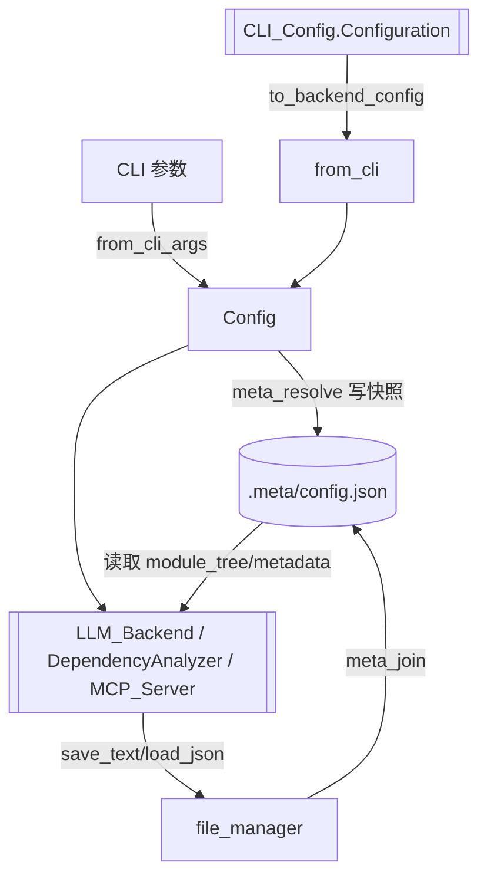

# SharedConfig 模块文档

## 概述

`SharedConfig` 是 CodeWiki 横跨 CLI、后端分析与 MCP 服务的**共享配置与文件管理基座**（位于 `codewiki/src/`）。它仅由两个源文件、6 个组件构成，却是各模块协同的基石：`Config` 统一承载仓库路径、LLM 端点、Token 预算、运行模式等全局参数，并提供 `from_cli`/`from_cli_args` 把命令行与 CLI 层配置桥接进后端；`file_manager` 单例负责所有 `.meta` 元数据的路径解析与读写，`meta_resolve` 确保跨模块对元数据位置有一致理解。[[DependencyAnalyzer]]、[[LLM_Backend]]、[[CLI_Config]]、[[MCP_Server]] 均依赖本模块。

## 组件清单

| 组件 | 类型 | 文件 | 职责 |
| --- | --- | --- | --- |
| Config | class | src/config.py | 全局配置模型：repo_path、output_dir、LLM 端点/模型、token 预算、provider、include/exclude 模式、verbose 等；提供 `from_cli`/`from_cli_args` 构造与路径解析 |
| ConfigError | exception | src/config.py | 配置相关错误（非法路径、缺参数等） |
| from_cli | function | src/config.py | 将 CLI 层 `Configuration`/运行参数适配为后端 `Config`，写入 `.meta` 配置快照 |
| from_cli_args | function | src/config.py | 从 argparse/Click 解析结果构造 `Config`（无 CLI 层依赖时的轻量入口） |
| meta_resolve | function | src/config.py | 将相对元数据路径解析为 `<output_dir>/.meta/` 下的绝对路径，统一元数据定位 |
| file_manager | singleton | src/utils.py | 文件读写单例：`save_text`/`load_text`/`save_json`/`load_json`/`meta_join`/`safe_join`，封装编码与原子写入 |

## 关键设计

### 配置模型（config.py）
- **Config**：以普通属性（非 Pydantic，便于轻量桥接）保存 `repo_path`(Path)、`output_dir`(Path)、`base_url`/`main_model`/`cluster_model`/`fallback_model`、`max_tokens`/`max_token_per_module`/`max_token_per_leaf_module`/`max_depth`、`provider`、`include_patterns`/`exclude_patterns`、`verbose`、`no_cache` 等。`__post_init__` 中规范化路径并校验输出目录可写。
- **from_cli**：关键桥接点——接收 [[CLI_Config]] 的 `Configuration.to_backend_config(...)` 产物（dict），结合运行期 `agent_instructions`，构造 `Config` 并调用 `meta_resolve` 写出 `<output>/.meta/config.json` 快照，供 [[MCP_Server]] / [[LLM_Backend]] 后续读取。
- **from_cli_args**：从命令行参数对象（含 `repo_path`、`--output`、`--main-model` 等）直接构造 `Config`，用于无 [[CLI_Config]] 层依赖的场景（如 [[WebApp]]、测试）。
- **ConfigError**：统一配置异常，被 [[CLI_Utils]] 的 `handle_error` 映射为退出码 2（配置错误）。
- **meta_resolve**：核心路径约定——所有 `.meta` 产物（module_tree.json、metadata.json、config.json、cross_service_links.json 等）统一位于 `<output_dir>/.meta/`，`meta_resolve(name)` 返回该目录下的绝对路径，避免各模块硬编码。

### 文件管理（utils.py）
- **file_manager**：模块级单例，提供 `save_text`/`load_text`（UTF-8、原子写入：临时文件+rename）、`save_json`/`load_json`（json 序列化封装，含缩进）、`meta_join`（拼接 `.meta` 路径）、`safe_join`（防路径穿越的 `Path` 拼接）。所有上层模块（[[LLM_Backend]] 的 `file_manager.py`、`[[MCP_Tools_*]]`）的落盘均经此单例，保证编码与目录约定一致。

## 数据流（mermaid）


## 依赖关系
- 被依赖：[[CLI]]、[[CLI_Config]]、[[CLI_Adapter]]、[[LLM_Backend]]、[[DependencyAnalyzer]]、[[GraphAndSort]]、[[AnalyzerModels]]、[[MCP_Server]]、[[MCP_Tools_Analysis]]、[[Frontend]]、[[WebApp]]。
- 依赖：标准库 `pathlib`/`json`；不直接依赖 LLM 或网络。
- 与 [[CLI_Utils]] 协同：配置错误经 `ConfigError` → `handle_error` 统一退出码。

## 使用示例
```python
from codewiki.src.config import Config, from_cli_args

# 从命令行参数构造
cfg = from_cli_args(
    repo_path="/path/to/repo",
    output_dir="/path/to/repo/wiki",
    base_url="https://api.openai.com/v1",
    main_model="gpt-4o",
)
print(cfg.output_dir, cfg.main_model)

# 元数据路径统一解析
config_path = cfg.meta_resolve("config.json")   # -> .../wiki/.meta/config.json

# 文件读写经单例
from codewiki.src.utils import file_manager
file_manager.save_text(config_path, "# wiki config")
data = file_manager.load_json(cfg.meta_resolve("metadata.json"))
```

## 扩展点
- **新增配置项**：在 `Config` 增加属性并在 `from_cli`/`from_cli_args` 增加映射即可，各消费方自动可见。
- **多后端存储**：`file_manager` 当前为本地文件系统，可抽象接口支持对象存储。
- **配置来源**：除 CLI 外，可增加环境变量/配置文件来源接入 `from_cli_args` 风格入口。
- **元数据布局**：`meta_resolve` 集中了 `.meta` 约定，调整目录结构只需改此处。

## 相关模块
- [[CLI]]、[[CLI_Config]]（配置持久化与 `Configuration.to_backend_config` 桥接）
- [[CLI_Adapter]]（消费 `Config` 驱动后端）
- [[LLM_Backend]]、[[DependencyAnalyzer]]、[[GraphAndSort]]、[[AnalyzerModels]]（消费 `Config` 与 `file_manager`）
- [[MCP_Server]]、[[MCP_Tools_Analysis]]、[[MCP_Tools_Dependency]]、[[MCP_Tools_DocWriter]]、[[MCP_Tools_Knowledge]]、[[MCP_Tools_Quality]]（MCP 层共享配置与文件管理）
- [[Frontend]]、[[WebApp]]、[[DocVisualizer]]（Web 层使用 `Config`/`meta_resolve`）