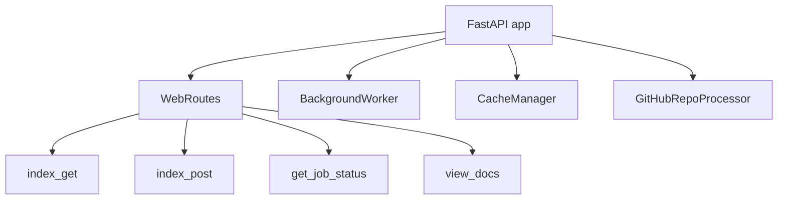

# Web Application

## Overview

FastAPI-based web application providing a UI for submitting GitHub repositories, monitoring documentation generation jobs, and browsing generated output.

## Architecture

## Components

### Web App (web_app.py)
- **index_get**: Landing page with repository submission form
- **index_post**: Accepts repo URL, queues generation job
- **get_job_status**: SSE endpoint for real-time job progress
- **view_docs**: Serves generated documentation HTML
- **serve_generated_docs**: Static file serving for output

### Background Processing
- **[BackgroundWorker](../../../codewiki/src/fe/background_worker.py)**: Thread pool for async job execution
- **[CacheManager](../../../codewiki/src/fe/cache_manager.py)**: Caches generation results for quick re-access
- **[GitHubRepoProcessor](../../../codewiki/src/fe/github_processor.py)**: Clones GitHub repos and triggers analysis

### Web [Config](../../../codewiki/src/config.py) & Routes
- **[WebAppConfig](../../../codewiki/src/fe/config.py)**: Port, host, template directory configuration
- **[WebRoutes](../../../codewiki/src/fe/routes.py)**: Route registration and middleware setup

### Models
- **[RepositorySubmission](../../../codewiki/src/fe/models.py)**: Input model for repo URL + options
- **[JobStatus](../../../codewiki/cli/models/job.py)/[JobStatusResponse](../../../codewiki/src/fe/models.py)**: Job state tracking (queued/running/completed/failed)
- **[CacheEntry](../../../codewiki/src/fe/models.py)**: Cached generation result with TTL

## Cross References

- [[LLM_Backend]]: [DocumentationGenerator](../../../codewiki/src/be/documentation_generator.py) called by [BackgroundWorker](../../../codewiki/src/fe/background_worker.py)
- [AnalysisPipeline](AnalysisPipeline.md): Core analysis invoked during generation
- [DocVisualizer](DocVisualizer.md): Renders and serves generated docs

<!-- crosslinks (auto-generated) -->
## Related Modules
- Depends on: [AnalysisPipeline](analysispipeline.md), [CLI_Config](cli_config.md), [DocVisualizer](docvisualizer.md), [LLM_Backend](llm_backend.md), [SharedConfig](sharedconfig.md)
