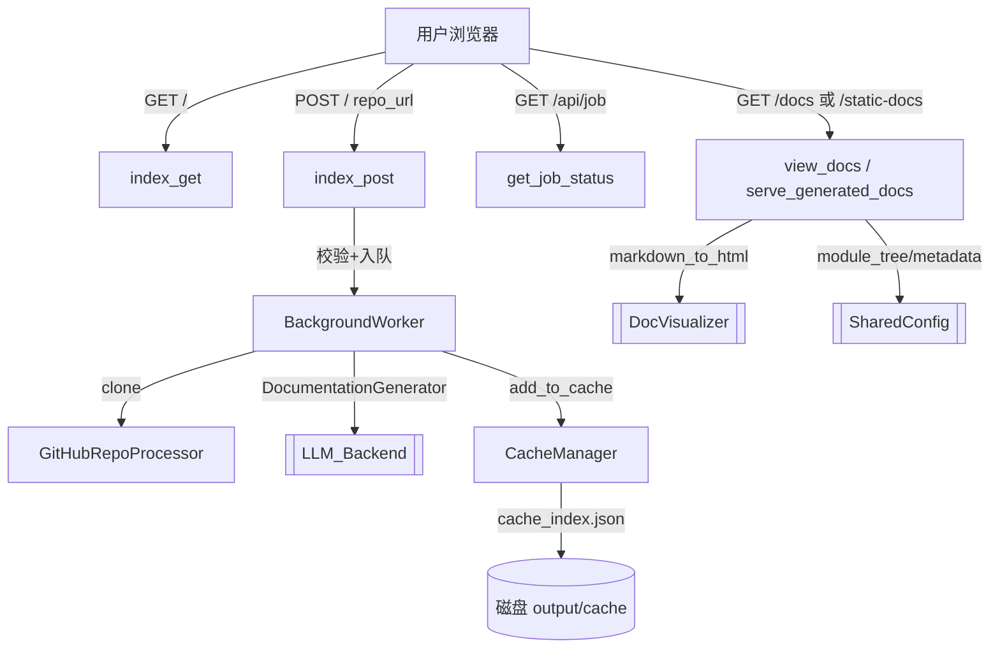

# WebApp 模块文档

## 概述

`Frontend/WebApp` 是 CodeWiki 的 Web 入口层，基于 FastAPI 提供图形化界面，让用户提交 GitHub 仓库 URL 即可异步生成完整文档。它由 7 个源文件、15 个组件组成，核心职责是：接收仓库提交、排队后台生成任务、缓存结果、跟踪任务状态、以及将生成的 Markdown 文档以 HTML 形式渲染展示。该模块是连接用户与 [[LLM_Backend]]（`DocumentationGenerator`）、[[SharedConfig]]（`Config`/`file_manager`）的胶水层，渲染复用 [[DocVisualizer]]（`markdown_to_html`、`get_file_title`）。

## 组件清单

| 组件 | 类型 | 文件 | 职责 |
| --- | --- | --- | --- |
| WebAppConfig | 配置类 | config.py | 集中管理缓存目录、临时目录、队列大小、缓存过期、服务器 host/port、Git 克隆超时/深度等常量，并负责目录创建与绝对路径解析 |
| BackgroundWorker | 后台服务 | background_worker.py | 守护线程消费任务队列，执行克隆→生成→缓存流程，维护内存 job 状态并持久化到 jobs.json |
| CacheManager | 缓存管理 | cache_manager.py | 以 repo URL 的 sha256 前 16 位为 key 管理文档缓存索引，支持查询/写入/过期清理 |
| GitHubRepoProcessor | 工具类 | github_processor.py | 校验 GitHub URL、提取 owner/repo/full_name/clone_url、克隆仓库（支持浅克隆与指定 commit checkout） |
| RepositorySubmission | 数据模型 | models.py | Pydantic 表单模型（repo_url: HttpUrl） |
| JobStatus | 数据模型 | models.py | dataclass，跟踪单个生成任务的状态、时间戳、进度、产物路径 |
| JobStatusResponse | 数据模型 | models.py | Pydantic 响应模型，供 `/api/job/{job_id}` 返回 |
| CacheEntry | 数据模型 | models.py | dataclass，表示一个缓存文档条目（repo_url/hash/path/时间） |
| WebRoutes | 路由处理 | routes.py | 聚合所有页面与 API 逻辑（索引页、提交、状态查询、文档查看/服务） |
| web_app.py::index_get | 视图函数 | web_app.py | 注册 `GET /`，渲染提交表单与最近任务列表 |
| web_app.py::index_post | 视图函数 | web_app.py | 注册 `POST /`，校验 URL 后将任务入队或命中缓存 |
| web_app.py::get_job_status | 视图函数 | web_app.py | 注册 `GET /api/job/{job_id}`，返回任务状态 JSON |
| web_app.py::view_docs | 视图函数 | web_app.py | 注册 `GET /docs/{job_id}`，重定向到文档查看器 |
| web_app.py::serve_generated_docs | 视图函数 | web_app.py | 注册 `GET /static-docs/{job_id}/{filename}`，加载模块树/元数据并将 Markdown 转 HTML 展示 |
| web_app.py::main | 入口函数 | web_app.py | 解析命令行参数，确保目录、启动后台 worker、用 uvicorn 拉起服务 |

## 关键设计

**1. 应用装配（web_app.py 模块级）**
模块导入时即创建全局单例：`CacheManager`、`BackgroundWorker`（持有 cache_manager）、`WebRoutes`（持有前两者），再用 `@app.get/post` 将 5 个视图函数绑定到 FastAPI 路由。`main()` 通过 `uvicorn.run("fe.web_app:app", ...)` 以 import string 方式启动，支持 `--host/--port/--debug/--reload`。

**2. 任务生命周期（routes.py + background_worker.py）**
- 提交：`index_post` 校验 URL → 规范化 → 由 `full_name.replace('/','--')` 生成 job_id → 检查是否已在队列/处理中（含 3 分钟重试冷却）→ 命中缓存则直接构造 completed 任务，否则构造 `queued` 任务并 `add_job` 入队。
- 处理：`BackgroundWorker._worker_loop` 守护线程轮询队列，`_process_job` 首先查缓存；未命中则 `GitHubRepoProcessor.clone_repository` 克隆，再用 `Config.from_args` 构造配置、`DocumentationGenerator(config, commit_id).run()` 在新建 asyncio 事件循环中生成，结束后 `cache_manager.add_to_cache` 并标记 completed。异常则标记 failed。
- 持久化：job 状态通过 `jobs.json`（仅加载 completed，避免不一致）与缓存重建（`_reconstruct_jobs_from_cache`）保证重启后可用。

**3. 缓存机制（cache_manager.py）**
`repo_url` 经 `hashlib.sha256` 取前 16 位作 key，`cache_index.json` 记录 `CacheEntry`。`get_cached_docs` 校验 `CACHE_EXPIRY_DAYS`（默认 365 天）内有效并刷新 `last_accessed`；`cleanup_expired_cache` 批量淘汰。`CACHE_EXPIRY_DAYS` 在 `WebAppConfig` 中定义。

**4. 文档展示（web_app.py::serve_generated_docs）**
根据 job_id 取 job 或回退到缓存；加载 `module_tree.json` 与 `metadata.json`（经 `meta_resolve` 解析路径），再用 [[DocVisualizer]] 的 `markdown_to_html`/`get_file_title` 渲染，套用 `DOCS_VIEW_TEMPLATE`，左侧导航来自 `module_tree`。

**5. 配置与常量（config.py）**
`WebAppConfig` 以类属性集中定义：目录（`./output/{cache,temp,}`）、`QUEUE_SIZE=100`、缓存过期、重试冷却 `RETRY_COOLDOWN_MINUTES=3`、清理 `JOB_CLEANUP_HOURS=24000`、`DEFAULT_HOST=127.0.0.1`、`DEFAULT_PORT=8000`、`CLONE_TIMEOUT=300`、`CLONE_DEPTH=1`，并提供 `ensure_directories` 与 `get_absolute_path`。

## 数据流



## 依赖关系

- 依赖 [[LLM_Backend]]：`DocumentationGenerator`、`Config`、`MAIN_MODEL`。
- 依赖 [[SharedConfig]]：`codewiki.src.config`（`Config.from_args`、`meta_resolve`、`meta_join`）、`codewiki.src.utils.file_manager`（load/save JSON/Text）。
- 依赖 [[DocVisualizer]]：`markdown_to_html`、`get_file_title`、`render_template`、`WEB_INTERFACE_TEMPLATE`、`DOCS_VIEW_TEMPLATE`。
- 同模块内部：web_app 装配 CacheManager/BackgroundWorker/WebRoutes；routes 调用 background_worker、cache_manager、github_processor、models。

## 使用示例

```bash
# 启动 Web 服务（默认 127.0.0.1:8000）
python -m codewiki.src.fe.web_app --host 0.0.0.0 --port 8000
```
浏览器访问首页，输入 `https://github.com/owner/repo` 提交，后台克隆并调用 [[LLM_Backend]] 生成；页面轮询 `GET /api/job/{job_id}` 显示进度，完成后 `GET /docs/{job_id}` 重定向至 `/static-docs/{job_id}/` 查看 HTML 文档。

## 扩展点

- **任务队列**：`BackgroundWorker.processing_queue` 为 `Queue`，可替换为 Redis/Celery 实现多进程或跨机调度。
- **缓存策略**：`CacheManager` 过期天数为类常量，可扩展为 LRU、基于 commit hash 的失效或远程对象存储。
- **多来源支持**：`GitHubRepoProcessor` 当前仅支持 github.com，可抽象出 `RepoProcessor` 接口支持 GitLab/本地路径。
- **认证与并发**：`WebAppConfig` 可加入 API Key、速率限制；`serve_generated_docs` 可加静态资源 CDN 化。
- **文档渲染**：复用 [[DocVisualizer]] 模板，可替换主题或注入交互式依赖图。

## 相关模块

- [[Frontend]]（整体前端，含 [[DocVisualizer]] 渲染能力）
- [[DocVisualizer]]（提供 `markdown_to_html` 等被本模块复用）
- [[CLI]]（同一 `DocumentationGenerator` 的命令行入口）
- [[CLI_Config]]（共享 `ConfigManager`/`Configuration` 理念）
- [[LLM_Backend]]（实际文档生成引擎 `DocumentationGenerator`）
- [[MCP_Server]]（另一文档生成与检索服务入口）
- [[SharedConfig]]（提供 `Config`、`file_manager`、路径解析 `meta_resolve`）