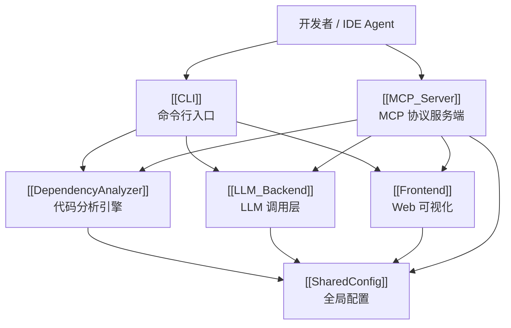

# CodeWiki-CN 架构总览

> 自动生成于 2026-07-28T18:00:00+08:00 | 本文件由系统自动维护

## 仓库总览

CodeWiki-CN 是一个**代码文档自动生成工具**：它扫描代码仓库，分析组件与依赖关系，借助 LLM 生成结构化的 LLM Wiki（Markdown 文档），并提供 MCP 服务端让 IDE Agent（Cursor / Claude Desktop）按需查询、摄取与校验文档。整个后端以 Python 实现，前端为 Web 可视化（Vue）。

仓库被聚类为 6 个顶级模块、**26 个文档化模块**，共覆盖 528 个组件。

## 架构图

## 模块分组

| 顶级模块 | 类型 | 子模块 |
|----------|------|--------|
| [[CLI]] | overview | [[CLI_Adapter]]、[[CLI_Commands]]、[[CLI_Config]]、[[CLI_Utils]] |
| [[DependencyAnalyzer]] | overview | [[AnalysisPipeline]]、[[AnalyzerModels]]、[[AnalyzerUtils]]、[[GraphAndSort]]、[[LanguageAnalyzers]]、[[RouteExtractors]] |
| [[Frontend]] | overview | [[DocVisualizer]]、[[WebApp]] |
| [[LLM_Backend]] | leaf | — |
| [[MCP_Server]] | overview | [[MCP_Cache]]、[[MCP_Core]]、[[MCP_Prompts]]、[[MCP_Tools_Analysis]]、[[MCP_Tools_Dependency]]、[[MCP_Tools_DocWriter]]、[[MCP_Tools_Knowledge]]、[[MCP_Tools_Quality]] |
| [[SharedConfig]] | leaf | — |

## 分层数据流

1. **分析阶段**：`[[CLI]]` 或 `[[MCP_Tools_Analysis]]` 触发 `[[DependencyAnalyzer]]`，扫描源码得到组件与依赖图，结果经 `[[MCP_Cache]]`（SQLite）缓存。
2. **生成阶段**：`[[AnalysisPipeline]]` 按模块树处理顺序驱动 `[[LLM_Backend]]` 生成每个模块的 Markdown 文档，由 `[[MCP_Tools_DocWriter]]` 落盘并注入 `[[...]]` 交叉链接。
3. **服务阶段**：`[[MCP_Server]]` 通过 `[[MCP_Core]]` 的 `call_tool` 路由，把分析/文档/知识/质量能力暴露给 IDE Agent；`[[MCP_Prompts]]` 提供工作流引导。
4. **校验阶段**：`[[MCP_Tools_Quality]]` 的 `lint_wiki` / `wiki_search` / `rebuild_index` 保证文档一致性、可检索性与健康度。
5. **可视化**：`[[Frontend]]`（[[DocVisualizer]] / [[WebApp]]）读取生成的 Wiki 做交互式浏览。
6. **配置**：`[[SharedConfig]]` 贯穿以上所有阶段，提供仓库路径、模型选择、输出目录等全局配置。

## 相关文档

- [项目文档索引](index.md)
- [项目文档约定](../schema.yaml)
- [AGENTS.md](../../AGENTS.md)
