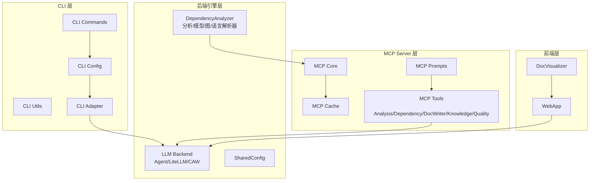
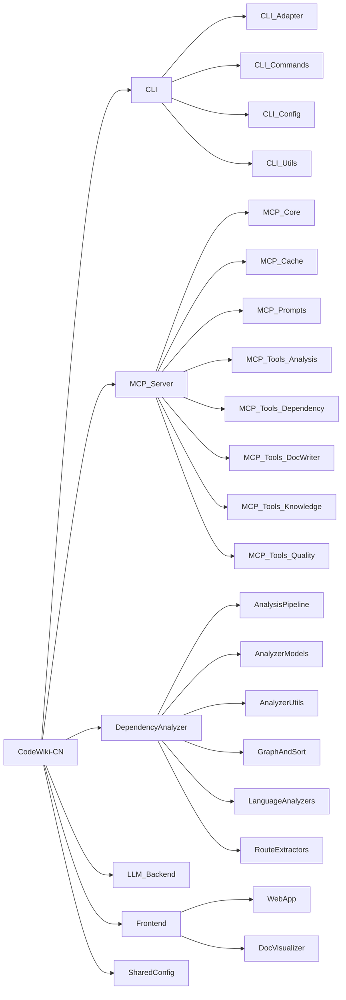
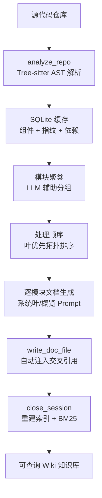

# CodeWiki-CN 项目概览

## 项目简介

CodeWiki-CN 是一个 **AI IDE 驱动的代码仓库文档生成与知识管理工具**，通过 MCP (Model Context Protocol) 协议与 AI IDE 深度集成，实现零配置的代码分析、模块聚类、Wiki 文档生成和知识库管理。

### 核心能力
- **零配置 LLM API**：由 AI IDE 自身模型驱动 Wiki 文档生成
- **23 个细粒度 MCP 工具**：Agent 全程可控文档生成流程
- **Evidence-Based 断言**：业务规则附带代码证据和置信度
- **增量更新**：方法级 content_hash 精确检测变更
- **Monorepo 跨服务分析**：自动检测子服务和跨服务调用关系
- **知识飞轮**：笔记 candidate → confirmed → rejected 状态流转
- **渐进式阅读**：overview / directory / detail 三种消费模式

### 技术栈
- **语言**：Python 3.12+
- **框架**：FastAPI + Uvicorn
- **AST 解析**：Tree-sitter (10 种语言)
- **存储**：SQLite 主存储 + JSON 兼容副本
- **搜索**：BM25 全文搜索 + wikilink 图谱多跳扩展
- **协议**：MCP stdio 传输

## 系统架构



## 模块导航

### 顶层模块

| 模块 | 组件数 | 描述 |
|------|--------|------|
| [CLI](modules/CLI.md) | 4 子模块 | Click 命令行界面，配置管理，文档生成命令 |
| [MCP_Server](modules/MCP_Server.md) | 8 子模块 | MCP 协议服务器，22 个细粒度工具 |
| [DependencyAnalyzer](modules/DependencyAnalyzer.md) | 6 子模块 | Tree-sitter 静态分析引擎 |
| [LLM_Backend](modules/LLM_Backend.md) | 54 | LLM 抽象层，Agent 工具，文档生成编排 |
| [Frontend](modules/Frontend.md) | 2 子模块 | FastAPI Web 应用与文档可视化 |
| [SharedConfig](modules/SharedConfig.md) | 6 | 全局配置常量与数据模型 |

### 完整模块树



## 数据流



## 目录结构

```
CodeWiki-CN/
├── codewiki/
│   ├── cli/           # CLI 层（命令、适配器、模型、工具）
│   ├── mcp/           # MCP Server（核心、缓存、工具实现）
│   └── src/
│       ├── be/        # 后端引擎（分析器、LLM、文档生成）
│       └── fe/        # 前端（Web 应用、可视化）
├── repowiki/          # 生成的 Wiki 文档
│   └── wiki/
│       ├── modules/   # 模块文档
│       ├── index.md   # 索引
│       └── log.md     # 生成日志
├── docker/            # Docker 部署配置
├── skills/            # Agent Skills 定义
├── tests/             # 测试文件
└── docs/              # 开发文档
```

## 快速链接

- **代码分析入口**：[MCP_Tools_Analysis](modules/MCP_Tools_Analysis.md) → `analyze_repo`
- **文档生成流程**：[MCP_Server](modules/MCP_Server.md) → Wiki Generation Workflow
- **依赖查询**：[MCP_Tools_Dependency](modules/MCP_Tools_Dependency.md) → `list_dependencies` / `analyze_impact`
- **知识查询**：[MCP_Tools_Knowledge](modules/MCP_Tools_Knowledge.md) → `query_wiki`
- **质量审计**：[MCP_Tools_Quality](modules/MCP_Tools_Quality.md) → `lint_wiki` (11 项检查)
- **LLM 集成**：[LLM_Backend](modules/LLM_Backend.md) → PydanticAI / CAW 双模式
- **Web 界面**：[WebApp](modules/WebApp.md) → FastAPI 仓库提交界面
